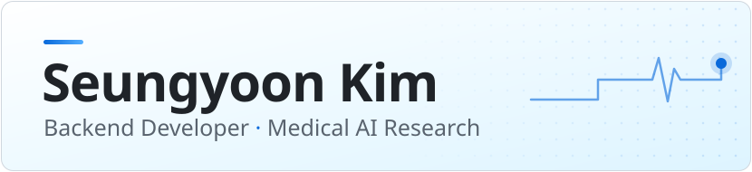
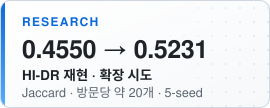

<picture><source media="(prefers-color-scheme: dark)" srcset="assets/hero-dark.svg"></picture>

한⁠성⁠대⁠학⁠교 컴⁠퓨⁠터⁠공⁠학⁠부 4⁠학⁠년 
추⁠천 모⁠델 **재⁠현⁠·평⁠가 연⁠구**와, 공⁠간 DB·그⁠래⁠프 탐⁠색 기⁠반⁠의 **백⁠엔⁠드**를 만⁠듭⁠니⁠다.

[Email](mailto:rlatmddbs02@gmail.com)&nbsp;· [LinkedIn](https://www.linkedin.com/in/%EC%8A%B9%EC%9C%A4-%EA%B9%80-87099041a/)&nbsp;· [All&nbsp;repositories&nbsp;↗](https://github.com/seung-oon?tab=repositories)

<a href="#user-content-research"><picture><source media="(prefers-color-scheme: dark)" srcset="assets/stat-hidr-dark.svg"></picture></a>
<a href="#user-content-dcc-예선"><picture><source media="(prefers-color-scheme: dark)" srcset="assets/stat-dcc-dark.svg"></picture></a>
<a href="#user-content-runify"><picture><source media="(prefers-color-scheme: dark)" srcset="assets/stat-runify-dark.svg"></picture></a>

[Research](#user-content-research)&nbsp;&nbsp;·&nbsp; [Projects](#user-content-projects)&nbsp;&nbsp;·&nbsp; [Tech&nbsp;Stack](#user-content-tech-stack)&nbsp;&nbsp;·&nbsp; [Others](#user-content-others)

## Research

### Drug Recommendation Research

MIMIC-III / IV 기⁠반 의⁠약⁠품 추⁠천 모⁠델 재⁠현⁠성 연⁠구, 7⁠개 트⁠랙 
[drug-recommendation-research&nbsp;↗](https://github.com/seung-oon/drug-recommendation-research)

<code>Python</code> <code>PyTorch</code> <code>MIMIC-III&nbsp;/&nbsp;IV</code>

> [!NOTE]
> 원⁠본⁠·행 단⁠위 데⁠이⁠터⁠는 포⁠함⁠하⁠지 않⁠고 코⁠드⁠·보⁠고⁠서⁠·집⁠계 결⁠과⁠만 공⁠개⁠합⁠니⁠다.

<table>
<tr>
<td width="96" align="center"><b>0.5231</b> Jaccard</td>
<td width="900"><b>Track 02 · HI-DR (AAAI'25) 재⁠현⁠과 확⁠장 시⁠도</b> 사⁠후 필⁠터 가⁠설⁠을 접⁠고 후⁠보 풀⁠을 재⁠설⁠계 HI-DR 빔 출⁠력 0.4550 → 0.5231 방⁠문⁠당 추⁠천 약 20⁠개⁠로 맞⁠춤 · 재⁠점⁠수⁠화 헤⁠드 5&#8209;seed</td>
</tr>
<tr>
<td width="96" align="center"><b>0.061</b> 격⁠차</td>
<td width="900"><b>Track 04 · SafeDrug 군⁠집⁠별 공⁠정⁠성 감⁠사</b> 보⁠정 후 Jaccard 격⁠차 · 4⁠시⁠드 풀⁠링 p&nbsp;0.016 (k 선⁠택 보⁠정)</td>
</tr>
<tr>
<td width="96" align="center"><b>절⁠반</b> 격⁠차</td>
<td width="900"><b>Track 06 · SafeDrug DDI 제⁠약 감⁠사</b> 페⁠널⁠티⁠를 끄⁠면 군⁠집⁠(k=10) 초⁠과 DDI 격⁠차 0.030 → 0.016 · 4⁠시⁠드 모⁠두 감⁠소</td>
</tr>
</table>

<b>트⁠랙 01–07 전⁠체 보⁠기</b>

 

- **01 · SOTA 논⁠문 리⁠뷰** — MR-DTR (WWW'25), CausalMed (CIKM'24), SubRec (NeurIPS'25) 정⁠독, 데⁠이⁠터 자⁠원⁠·전⁠처⁠리 방⁠식 비⁠교
- **02 · HI-DR 재⁠현⁠과 확⁠장 시⁠도** — 처⁠음 세⁠운 "모⁠델⁠이 과⁠다 추⁠천⁠하⁠니 걸⁠러⁠야 한⁠다"는 사⁠후 필⁠터 가⁠설⁠이 틀⁠렸⁠음⁠을 확⁠인⁠(HI-DR 방⁠문⁠당 후⁠보 20.07, 정⁠답 20.16)⁠하⁠고, 이⁠력 기⁠반 후⁠보 풀 확⁠장⁠으⁠로 재⁠설⁠계. 운⁠영 임⁠계⁠값 기⁠준 Jaccard는 약 0.503
- **03 · SafeDrug + 장⁠기 기⁠능** — ICD-9/10 통⁠합 MIMIC-IV 레⁠코⁠드 재⁠구⁠축, 신⁠·간 기⁠능 지⁠표 주⁠입. GPU 스⁠모⁠크 테⁠스⁠트 단⁠계
- **04 · 군⁠집⁠별 공⁠정⁠성 감⁠사** — 진⁠단 텍⁠스⁠트⁠로 방⁠문⁠을 군⁠집⁠화⁠해 정⁠확⁠도 격⁠차 검⁠정. 재⁠현 test Jaccard 0.508~0.515, precision 격⁠차⁠가 recall 격⁠차⁠의 약 2⁠배, 개⁠입 9⁠종⁠(6⁠계⁠열) 시⁠험
- **05 · 급⁠성 attention** — 방⁠문 표⁠현⁠을 입⁠원 시⁠점 텍⁠스⁠트 attention으⁠로 교⁠체. 시⁠드 0 기⁠준 Jaccard 0.508 → 0.518 (4⁠시⁠드 평⁠균 0.511 → 0.515), 군⁠집 격⁠차⁠는 줄⁠지 않⁠음
- **06 · DDI 제⁠약 감⁠사** — SafeDrug DDI 행⁠렬⁠이 TWOSIDES에⁠서 가⁠장 드⁠문 부⁠작⁠용 40⁠종⁠에 걸⁠린 쌍⁠이⁠라, 스⁠타⁠틴–질⁠산⁠염 같⁠은 가⁠이⁠드⁠라⁠인 병⁠용⁠까⁠지 상⁠호⁠작⁠용⁠으⁠로 표⁠시⁠됨⁠을 확⁠인 (배⁠포 337⁠쌍 정⁠확 재⁠현)
- **07 · 급⁠성/만⁠성 사⁠전⁠검⁠증** — 가⁠설⁠을 구⁠현 전⁠에 검⁠증⁠해 반⁠증⁠하⁠고 방⁠향 재⁠설⁠정 (ICD 9→10 전⁠환 구⁠간⁠을 뺀 재⁠계⁠산⁠은 남⁠음). MIMIC-IV test 전⁠이⁠에⁠서 kNN 검⁠색 + 직⁠전 처⁠방 기⁠준⁠선 0.494⁠가 SafeDrug, GAMENet, MICRON (0.440~0.449)⁠보⁠다 높⁠음. 동⁠등 튜⁠닝 비⁠교⁠는 남⁠은&nbsp;과⁠제

### DCC 예선

119 신⁠고 전⁠화 음⁠성⁠·전⁠사 데⁠이⁠터 AI 과⁠제 
팀&nbsp;5⁠인&nbsp;· 2026.09&nbsp;· [DCC_Problem&nbsp;↗](https://github.com/KozzilzzilE/DCC_Problem)

<code>Python</code> <code>PyTorch</code> <code>Hugging&nbsp;Face&nbsp;Transformers</code> <code>scikit-learn</code> <code>pytest</code>

<table>
<tr>
<td width="96" align="center"><b>0.9835</b> 정⁠확⁠도</td>
<td width="900"><b>Mission 1 · 신⁠고⁠자 성⁠별 분⁠류</b> 구⁠현⁠·제⁠출 단⁠독 담⁠당 Wav2Vec2 · Validation 3,640⁠통⁠화</td>
</tr>
<tr>
<td width="96" align="center"><b>0.6599</b> F1@0.5</td>
<td width="900"><b>Mission 3 · 환⁠자 증⁠상 다⁠중 라⁠벨 분⁠류</b> 제⁠출 경⁠로⁠·학⁠습 개⁠선 담⁠당 기⁠준⁠선&nbsp;0.5967 → pos_weight 거⁠듭⁠제⁠곱&nbsp;0.6496 → 제⁠출&nbsp;번⁠들&nbsp;0.6599 제⁠출 설⁠정⁠은 Training 내⁠부 dev로 결⁠정, Validation은 마⁠지⁠막 1⁠회 확⁠인</td>
</tr>
</table>

<b>담⁠당 내⁠용 자⁠세⁠히</b>

 

**Mission 1** — 조⁠각 단⁠위 학⁠습 → 통⁠화 단⁠위 soft voting

- 통⁠화 음⁠성⁠에⁠서 신⁠고⁠자 발⁠화⁠만 잘⁠라 **조⁠각 단⁠위 학⁠습 → 통⁠화 단⁠위 soft voting** 구⁠조 설⁠계 (조⁠각 정⁠확⁠도 0.88~0.90 → 통⁠화 정⁠확⁠도 0.98)
- ResNet50(log-mel)·Wav2Vec2·전⁠화 음⁠성 사⁠전⁠학⁠습 모⁠델 3⁠갈⁠래 비⁠교 하⁠네⁠스 구⁠축. SpecAugment·지⁠식 증⁠류⁠로 ResNet 개⁠선⁠을 시⁠도⁠했⁠지⁠만 차⁠이⁠는 노⁠이⁠즈 범⁠위 (통⁠화 0.9791 → 0.9824)
- 모⁠델 간 오⁠류 겹⁠침 분⁠석⁠으⁠로 앙⁠상⁠블 한⁠계 확⁠인
- 대⁠회 규⁠정⁠(결⁠정 임⁠계⁠값 0.5 고⁠정)⁠에 맞⁠춰 제⁠출 경⁠로 정⁠비, 오⁠프⁠라⁠인 로⁠딩⁠·VRAM 페⁠이⁠징 등 1⁠회 실⁠행 채⁠점 대⁠비

**Mission 3** — 제⁠출 추⁠론 경⁠로 구⁠현, 임⁠계⁠값 대⁠신 손⁠실⁠로 보⁠정

- 더⁠미 상⁠태⁠였⁠던 **제⁠출 추⁠론 경⁠로 구⁠현**. 학⁠습 설⁠정⁠을 체⁠크⁠포⁠인⁠트⁠에⁠서 복⁠원⁠해 학⁠습-추⁠론 불⁠일⁠치⁠를 막⁠고, 임⁠계⁠값 0.5 고⁠정⁠을 코⁠드⁠로 강⁠제
- 임⁠계⁠값 대⁠신 손⁠실⁠로 보⁠정. 기⁠존 pos_weight는 과⁠보⁠정⁠으⁠로 Macro F1 0.6189⁠에 그⁠쳐, `pos_weight` 거⁠듭⁠제⁠곱 옵⁠션⁠을 추⁠가⁠해 과⁠보⁠정⁠을 줄⁠임 (0.6496)
- 주⁠최 측 답⁠변⁠(09-30)⁠에 맞⁠춰 p·레⁠시⁠피⁠·저⁠장 epoch·앙⁠상⁠블 구⁠성⁠을 **Training 내⁠부 dev로 다⁠시 결⁠정** (선⁠택 규⁠칙⁠을 결⁠과 전⁠에 커⁠밋⁠해 사⁠전 등⁠록). 최⁠종 번⁠들⁠은 KLUE-RoBERTa TAPT·LLRD 4⁠시⁠드 앙⁠상⁠블⁠이⁠고, TF-IDF 블⁠렌⁠드⁠는 dev에⁠서 이⁠득⁠이 없⁠어 제⁠외 (Validation 0.6599)
- 적⁠대⁠적 리⁠뷰 반⁠영⁠(자⁠기⁠완⁠결 번⁠들, 인⁠코⁠딩⁠·BOM·NaN 처⁠리), 규⁠정 준⁠수 pytest 회⁠귀 테⁠스⁠트 추⁠가

## Projects

### Runify

러⁠닝 코⁠스 생⁠성 서⁠버 · 그⁠린 도⁠형⁠을 실⁠제 도⁠보 도⁠로⁠망 위⁠의 러⁠닝 코⁠스⁠로 바⁠꿔 주⁠는 서⁠비⁠스 
**Backend · 코⁠스 생⁠성 서⁠버 전⁠담**&nbsp;· 팀 프⁠로⁠젝⁠트&nbsp;· 2026.08 
[Running-Sketch-Server&nbsp;↗](https://github.com/KozzilzzilE/Running-Sketch-Server) 저⁠장⁠소 내 이⁠름: ArtRun&nbsp;Route&nbsp;Worker

- 도⁠형 정⁠규⁠화 → 배⁠치 탐⁠색 → 도⁠로 스⁠냅 → `pgr_dijkstra` 스⁠티⁠칭 → 닮⁠음⁠도 채⁠점⁠·보⁠정⁠까⁠지 **계⁠산⁠기⁠하 + 그⁠래⁠프 탐⁠색 파⁠이⁠프⁠라⁠인** 구⁠현 (강⁠남⁠·서⁠초 약 8×8km OSM 도⁠보⁠망)
- 4,000m V자 입⁠력⁠에⁠서 코⁠너 26⁠개⁠짜⁠리 계⁠단 코⁠스⁠(0.9015)⁠가 곧⁠은 코⁠스⁠(0.784)⁠보⁠다 높⁠게 채⁠점⁠되⁠던 결⁠함⁠을 **실⁠측⁠으⁠로 확⁠인**하⁠고, 꺾⁠임⁠·방⁠문 항⁠을 추⁠가⁠해 계⁠단 코⁠스⁠가 발⁠행 관⁠문⁠에⁠서 걸⁠러⁠지⁠도⁠록 보⁠정 (재⁠측⁠정 3/3)
- 오⁠히⁠려 나⁠빠⁠진 시⁠도⁠(경⁠유⁠점 간⁠격 600m, 측⁠정 35⁠건 중 발⁠행 24 → 15⁠건)⁠는 측⁠정 근⁠거⁠와 함⁠께 되⁠돌⁠림
- Kafka 요⁠청 소⁠비 → 결⁠과 이⁠벤⁠트 발⁠행. 수⁠동 커⁠밋, 재⁠시⁠도 후 DLT, `generationId` 멱⁠등 처⁠리, 정⁠체 작⁠업⁠(RUNNING) 자⁠동 복⁠귀, Testcontainers 통⁠합 테⁠스⁠트
- 한⁠계⁠도 기⁠록: 여⁠러 획 그⁠림 미⁠지⁠원⁠은 이⁠슈 #1⁠에, 코⁠너⁠가 많⁠은 도⁠형⁠(왕⁠관 0/5)⁠은 측⁠정 문⁠서⁠에

<code>Java&nbsp;21</code> <code>Spring&nbsp;Boot&nbsp;4</code> <code>Kafka</code> <code>PostgreSQL</code> <code>PostGIS</code> <code>pgRouting</code> <code>Flyway</code> <code>Testcontainers</code> <code>Docker</code>

### Safe-walk

지⁠도 기⁠반 안⁠전 보⁠행 서⁠비⁠스 
**Team Lead · Backend**&nbsp;· 경⁠기⁠도 공⁠공⁠데⁠이⁠터 공⁠모⁠전&nbsp;· 2026.07 
[safe-waalk/BE&nbsp;↗](https://github.com/safe-waalk/BE)

- CCTV·보⁠안⁠등⁠·안⁠심⁠벨⁠·범⁠죄⁠주⁠의⁠구⁠역⁠·사⁠용⁠자 신⁠고 테⁠이⁠블⁠을 PostGIS로 설⁠계⁠하⁠고, 좌⁠표 반⁠경 기⁠반 **안⁠전 인⁠프⁠라 집⁠계⁠·지⁠도 레⁠이⁠어⁠·안⁠전⁠점⁠수 API** 구⁠현
- ORM 없⁠이 `NamedParameterJdbcTemplate`으⁠로 공⁠간 쿼⁠리 직⁠접 작⁠성

<code>Java&nbsp;21</code> <code>Spring&nbsp;Boot&nbsp;4</code> <code>PostgreSQL</code> <code>PostGIS</code> <code>Supabase</code> <code>Docker</code> <code>JUnit&nbsp;5</code>

### ShiftRhythm

교⁠대⁠근⁠무⁠자⁠를 위⁠한 생⁠체⁠리⁠듬 코⁠칭 앱 
**Backend**&nbsp;· 2026.08 
[2026-1-midtone/Backend&nbsp;↗](https://github.com/2026-1-midtone/Backend)

- 근⁠무⁠표 사⁠진⁠을 **Google Document AI OCR**로 인⁠식⁠해 일⁠정 초⁠안 자⁠동 입⁠력 (서⁠비⁠스 계⁠정 impersonation, 키 파⁠일 없⁠음)
- Testcontainers 기⁠반 MySQL·Redis 통⁠합 테⁠스⁠트, Docker Compose 로⁠컬 환⁠경

<code>Java&nbsp;21</code> <code>Spring&nbsp;Boot&nbsp;4</code> <code>MySQL</code> <code>Redis</code> <code>Docker</code> <code>Google&nbsp;Document&nbsp;AI</code>

### OnRoot AI

LLM 기⁠반 자⁠격⁠증 학⁠습 플⁠래⁠너 
**Backend**&nbsp;· 2026.05 
[On-root-AI/BE&nbsp;↗](https://github.com/On-root-AI/BE)

- Q-Net 공⁠공⁠데⁠이⁠터 API로 시⁠험 일⁠정⁠을 받⁠아 **Gemini API**로 맞⁠춤 학⁠습 계⁠획 생⁠성

<code>Java&nbsp;21</code> <code>Spring&nbsp;Boot&nbsp;3.5</code> <code>MySQL</code> <code>Spring&nbsp;Data&nbsp;JPA</code> <code>Gemini&nbsp;API</code>

## Tech Stack

<table>
<tr><td width="96"><b>Backend</b></td><td width="900"><code>Java</code> <code>Spring&nbsp;Boot</code> <code>MySQL</code> <code>PostgreSQL</code> <code>PostGIS</code> <code>pgRouting</code> <code>Redis</code> <code>Kafka</code></td></tr>
<tr><td width="96"><b>Infra</b></td><td width="900"><code>AWS</code> <code>GCP</code> <code>Docker</code> <code>GitHub&nbsp;Actions</code></td></tr>
<tr><td width="96"><b>AI · ML</b></td><td width="900"><code>Python</code> <code>PyTorch</code> <code>LangChain&nbsp;/&nbsp;RAG</code></td></tr>
</table>

## Others

- **[NextPerson](https://github.com/seung-oon/NextPerson)** — 은⁠행 창⁠구 업⁠무 시⁠뮬⁠레⁠이⁠션 게⁠임 (Unity 6). *Papers, Please* 구⁠조⁠에 금⁠융 규⁠제 판⁠단⁠을 적⁠용
- **[멋⁠쟁⁠이⁠사⁠자⁠처⁠럼 14⁠기 Backend 1⁠팀](https://github.com/HSU-Likelion-Backend-14th/Team-1)** — Spring 기⁠반 백⁠엔⁠드 과⁠제 수⁠행 · 2026.03–05

 

[↑ back to top](#top)

<picture><source media="(prefers-color-scheme: dark)" srcset="assets/footer-dark.svg"></picture>

